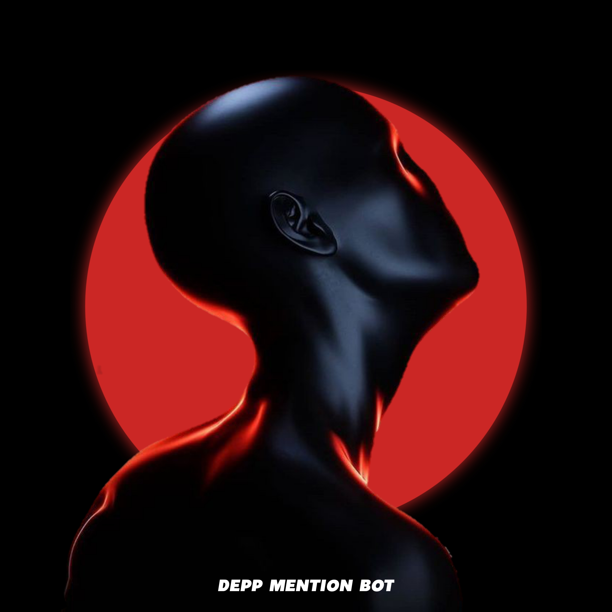

<h1 align= center>MentionDepp</h1>
<h3 align = center>Powerful Telegram bot to get everyone's attention by mentioning all members in the chat.
<br>MentionDepp bot has some additional cool features and also it can work in channels.
    
<br>💥 Easy    ⚡️ Fast    ✨ Self Deployable</h3>


<p align="center">
<a href="https://python.org"></a>
<br>
    
    
     
<br>
    
    
    
    
</p>  


<h1 align="center">
    
    <br>
    Mention Depp Bot
</h1>

    
## ⚒ Config Vars

1. `API_ID` : Telegram API_ID, get it from my.telegram.org/apps
2. `API_HASH` : Telegram API_ID, get it from my.telegram.org/apps
3. `BOT_TOKEN` : A Valid Telegram Bot Token, get it from @Botfather


## 📄 Commands

### 🛎 ping , all

- To get everyone's attention by mentioning all members in the chat.

```
/ping <input>    
```
    
### 👻 remove , clean

- To remove all deleted accounts from the chat.

### 👮🏻 admins , staff

- To mention all admins while getting the full non-anonymous admin list of the chat.

### 👾 bots 

- To get the full bot list of the chat.

### 🛑 stop , cancel

- To stop an on going process in the chat.
 
 
## ☁️ Deployment Methods

### Heroku

[](https://heroku.com/deploy?template=https://github.com/Lukymura/MentionDepp)
    
### Okteto

[](https://cloud.okteto.com)
    
## ⭐️ Credits
  
- [Lukymura](https://github.com/Lukymura)
- [Thakshaka](https://t.me/thakshakar)
- [Pyrogram](https://github.com/pyrogram/pyrogram)


## 🚨 Warning

- Changing the code is NOT ALLOWED!  
- Everyone is permitted to copy this work, but you MUST include the following in your README document.

```
## Credits
- [Mention Depp by Lukymura] (https://github.com/Lukymura/MentionDepp)
```


## ⚖️ License
  
Ping All is licensed under the [GNU Affero General Public License v3.0](https://github.com/Lukymura/MentionDepp/blob/main/LICENSE)

Copyright ©️ 2022 Lukymura. All Rights Reserved
